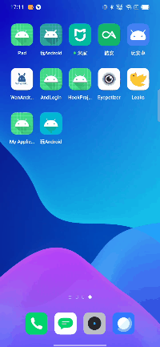

# Hook
一个Hook AMS和Hook Handler实现不注册Activity即可跳转的lib和demo

## 项目截图
 

### 注意
将该项目clone到本地的时候，需要在项目根目录下面添加**gradle.properties**文件，文件内容如下：
```class
org.gradle.jvmargs=-Xmx2048m -Dfile.encoding=UTF-8   
android.useAndroidX=true   
android.enableJetifier=true   
kotlin.code.style=official
```

### 如何使用
* 不需要在自己工程中添加任何代码，即可实现在没有注册Activity的时候，跳转到目标Activity
* 在项目的`build.gradle`中添加如下依赖：
```
implementation 'io.github.bbggo:hook:1.0.2'
```
不需要再注册Activity，然后像正常启动Activity一样启动就可以了。

### 原理
其实就是Hook AMS和Hook Handler。如下只贴出了关键代码，想看详细代码在**HookUtils**文件中
- Hook AMS
```
val proxyInstance = Proxy.newProxyInstance(
                    Thread.currentThread().contextClassLoader, arrayOf(iActivityManagerClass)
                ) { proxy, method, args ->
                    if (method.name == "startActivity") {
                        var pos = 0
                        for (i in args.indices) {
                            if (args[i] is Intent) {
                                pos = i
                                break
                            }
                        }
                        val originIntent = args[pos] as Intent
                        val proxyIntent = Intent(originIntent)
                        proxyIntent.setClass(context, ProxyActivity::class.java)
                        proxyIntent.putExtra(INTENT_KEY, originIntent)
                        args[pos] = proxyIntent
                    }
                    if (args == null) return@newProxyInstance Unit
                    method.invoke(mInstance, *args)
                }
```

- Hook Handler
```
private fun hookHandler() {
            try {
                val activityThreadClz = Class.forName("android.app.ActivityThread")
                val sCurrentActivityThread =
                    activityThreadClz.getDeclaredField("sCurrentActivityThread")
                sCurrentActivityThread.isAccessible = true
                val activityThread = sCurrentActivityThread[null]
                val mHField = activityThreadClz.getDeclaredField("mH")
                mHField.isAccessible = true
                val mH = mHField[activityThread]
                val handlerSuperClz = mH.javaClass.superclass
                val mCallbackField = handlerSuperClz.getDeclaredField("mCallback")
                mCallbackField.isAccessible = true
                mCallbackField[mH] = HookCallBack()
            } catch (e: Exception) {
                e.printStackTrace()
            }
        }
```